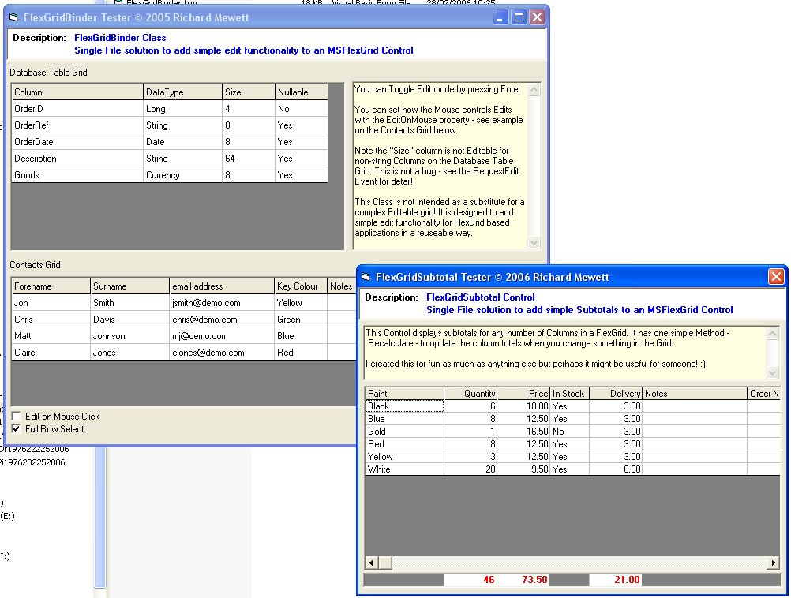



## FlexGridToys \- Class to add Edit functionality &amp;  Subtotal Control \(05 Apr 06\)

### Description

Two little MSFlexGrid enhancers. A single class adds simple Edit functionality. The principle is to make it quick and easy to update existing code and/or create new code in a consistent and resuseable way.

The Subtotal Control allows a simple subtotal row for any combination of the columns.

Please feel to modify as you need. As always feedback is welcome....
 
### More Info
 

             |
---                |---
**Submitted On**   |2006-04-03 18:15:42
**By**             |[Richard Mewett](https://github.com/Planet-Source-Code/PSCIndex/blob/master/ByAuthor/richard-mewett.md)
**Level**          |Intermediate
**User Rating**    |5.0 (50 globes from 10 users)
**Compatibility**  |VB 6\.0
**Category**       |[Custom Controls/ Forms/  Menus](https://github.com/Planet-Source-Code/PSCIndex/blob/master/ByCategory/custom-controls-forms-menus__1-4.md)
**World**          |[Visual Basic](https://github.com/Planet-Source-Code/PSCIndex/blob/master/ByWorld/visual-basic.md)
**Archive File**   |[FlexGridTo198490432006\.zip](https://github.com/Planet-Source-Code/richard-mewett-flexgridtoys-class-to-add-edit-functionality-amp-subtotal-control-05-apr-06__1-64400/archive/master.zip)

